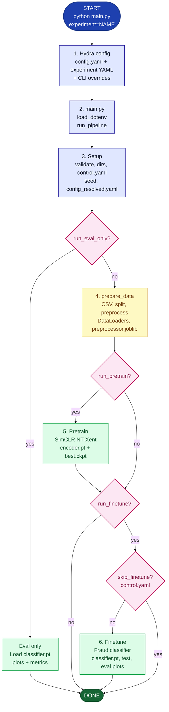
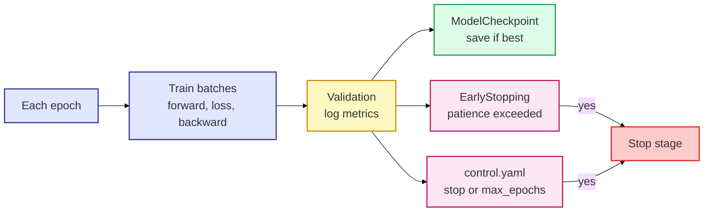

# Pipeline overview

How a training run flows from `python main.py` through data, SimCLR pretrain, classifier finetune, and evaluation.

> **Tip:** View this file on GitHub or in a Markdown preview with Mermaid support. For the largest diagram, open the chart at [mermaid.live](https://mermaid.live) and export PNG/SVG at 2× zoom.

---

## High-level flowchart



---

## Entry point

| Step | File | What happens |
|------|------|----------------|
| CLI | `main.py` | Hydra parses `configs/` and CLI args into one `DictConfig` |
| Env | `.env` | `WANDB_API_KEY`, optional `WANDB_ENTITY` |
| Orchestrator | `src/simclr_fraud/train/pipeline.py` | `run_pipeline(cfg)` runs all stages |

Equivalent commands after `pip install -e .`:

```bash
python main.py experiment=mini
simclr-run experiment=mini
python -m simclr_fraud.train experiment=mini
```

---

## Config merge

```text
configs/config.yaml           seed, run_pretrain, run_finetune, run_eval_only
        +
configs/experiment/mini.yaml  name, data, model, pretrain, finetune, wandb, eval
        +
CLI                           experiment=gpu5090 run_pretrain=false ...
        ↓
outputs/{name}/config_resolved.yaml   (frozen snapshot written at run start)
```

The experiment **`name`** (e.g. `mini`, `gpu5090`) determines every output path under `outputs/{name}/`.

---

## Stage details

### 3. Setup (`pipeline.py` + `config.py` + `control.py`)

- **`validate_config`** — requires `name`, valid `data.fraction`
- **`ensure_experiment_dirs`** — creates `pretrain/checkpoints`, `finetune/checkpoints`, `eval`
- **`ensure_control_file`** — `outputs/{name}/control.yaml` (stop / max_epochs / skip_finetune)
- **`L.seed_everything(seed)`** — global reproducibility (`seed` in `config.yaml`)
- **`save_resolved_config`** — writes merged YAML for later predict/eval

### 4. Data (`data.py` → `prepare_data`)

1. **`ensure_csv`** — download PaySim to `data/raw/paysim.csv` if missing
2. **Stratified split** — train / val / test (`data.split.*`)
3. **Sklearn preprocessor** — fit on **train only**, transform val/test
4. **Save** — `outputs/{name}/preprocessor.joblib`
5. **Subset** — optional `data.fraction` (stratified)
6. **DataLoaders** — 5 loaders in `ExperimentData`:
   - `simclr_train`, `simclr_val` — augmented pairs (`datasets.SimCLRTabularDataset`)
   - `train`, `val`, `test` — `(features, label)` (`datasets.FraudDataset`)

### 5. Pretrain (`train/pretrain.py`) — if `run_pretrain: true`

- **Model:** `LitSimCLR` — encoder + projection head
- **Loss:** NT-Xent (`models/losses.py`)
- **Trainer:** Lightning + `ModelCheckpoint` (best `val_loss`) + optional `EarlyStopping` + `RuntimeControlCallback`
- **After fit:** reload best checkpoint → save **`outputs/{name}/pretrain/encoder.pt`**

### 6. Finetune (`train/finetune.py`) — if `run_finetune: true`

**Encoder load order:**

1. `finetune.encoder_checkpoint` if set in config/CLI
2. else `outputs/{name}/pretrain/encoder.pt` if it exists
3. else random encoder (baseline path)

- **Model:** `LitFraudClassifier` — BCE with `pos_weight`, metrics (AUROC, PR-AUC, F1)
- **Trainer:** checkpoint on `val_pr_auc`, early stopping, control callback
- **After fit:** reload best checkpoint → save **`outputs/{name}/finetune/classifier.pt`**
- **Test** → `outputs/{name}/eval/metrics.json`
- **Eval plots** → `outputs/{name}/eval/*.png` (`evaluate/run.py`)

### Eval only — if `run_eval_only: true`

Skips training. Loads `classifier.pt`, runs evaluation plots/metrics (`train/eval_only.py`).

### Batch predict (separate CLI)

```bash
simclr-predict --experiment mini --input rows.csv --output scores.csv
```

Uses `config_resolved.yaml` + `preprocessor.joblib` + `classifier.pt` (`predict.py`).

---

## Artifact layout

```text
outputs/{name}/
├── config_resolved.yaml      # architecture + data settings (for predict)
├── control.yaml              # live training controls
├── preprocessor.joblib       # sklearn transform (train-fit)
├── pretrain/
│   ├── encoder.pt            # weights for finetune
│   └── checkpoints/best*.ckpt
├── finetune/
│   ├── classifier.pt         # full model for predict / eval-only
│   └── checkpoints/best*.ckpt
└── eval/
    ├── metrics.json
    ├── threshold_metrics.csv
    └── *.png
```

Path helpers: `src/simclr_fraud/paths.py`. Save locations are **not** configurable in YAML (only `finetune.encoder_checkpoint` overrides **load** path for the encoder).

---

## Training loop (inside Lightning)



At stage end: **best checkpoint is reloaded** before exporting `.pt` files and running test/eval.

---

## Tests and CI

| Layer | What runs | Purpose |
|-------|-----------|---------|
| **Unit tests** | `pytest tests/` | Losses, augmentation, subset, control, plots, W&B config, predict (mocked) |
| **CI lint** | `ruff check src tests` | Style / obvious bugs |
| **CI smoke** | 1-epoch `experiment=mini` on fixture CSV | End-to-end pipeline without PaySim download |

See `.github/workflows/ci.yml`.

---

## Related docs

- [README.md](../README.md) — setup and example run commands
- `configs/experiment/*.yaml` — per-experiment hyperparameters
